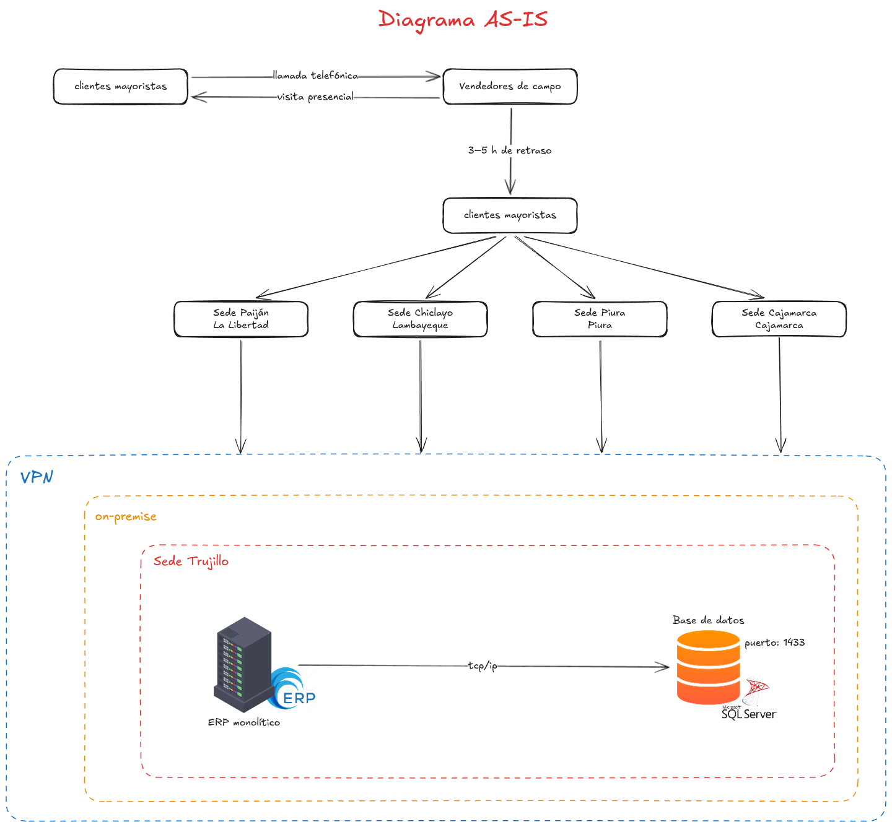

# DistriNorte Perú S.A.C.

## 1. Descripción de la empresa

DistriNorte Perú S.A.C. es una empresa distribuidora mayorista de productos de consumo masivo (FMCG, por sus siglas en inglés: _Fast-Moving Consumer Goods_) fundada en el año 2004 en la ciudad de Trujillo, región La Libertad. Desde su fundación, la empresa ha crecido de manera orgánica hasta consolidarse como uno de los principales distribuidores mayoristas de la macrorregión norte del país, con presencia activa en las regiones de La Libertad, Lambayeque, Piura y Cajamarca.

El modelo de negocio de DistriNorte es estrictamente B2B (_business-to-business_): la empresa no vende al consumidor final, sino que actúa como intermediario entre los grandes fabricantes de productos de consumo y los puntos de venta minoristas de la región. Sus clientes son bodegas, minimarkets, restaurantes, mercados de abastos y establecimientos de hostelería que adquieren productos al por mayor para su reventa o consumo comercial.

DistriNorte opera como distribuidor autorizado de diversas marcas líderes del mercado peruano. Su portafolio incluye productos de las categorías de bebidas, alimentos procesados, cuidado personal y productos para el hogar, representando marcas de fabricantes como PepsiCo, AJE Group, Backus, Alicorp, Nestlé y Gloria, entre otros. Esta amplitud de portafolio le permite ofrecer a sus clientes un único punto de compra para la mayoría de sus necesidades de abastecimiento, lo que constituye una de sus principales ventajas competitivas frente a distribuidores especializados en una sola categoría.

---

## 2. Estructura operacional

DistriNorte cuenta actualmente con cinco sedes operativas distribuidas en la macrorregión norte:

- **Sede central — Trujillo (La Libertad):** Alberga las oficinas administrativas, el almacén principal y el centro de procesamiento de pedidos. Es el núcleo operativo de la empresa y donde reside la infraestructura tecnológica central, incluyendo el servidor que hospeda el sistema ERP.
- **Sede Paiján (La Libertad):** Punto de distribución secundario que atiende a la zona norte de La Libertad, incluyendo Ascope y Santiago de Cao.
- **Sede Chiclayo (Lambayeque):** Cubre la región Lambayeque completa, con especial concentración en el mercado mayorista de Moshoqueque.
- **Sede Piura:** Atiende Piura, Sullana y Paita.
- **Sede Cajamarca:** La de menor volumen, orientada principalmente al canal de restaurantes y hospedajes de la sierra norte.

La empresa emplea actualmente a 680 personas, distribuidas entre personal de almacén, conductores y operarios de reparto, vendedores de campo, personal administrativo y equipos de soporte comercial. La flota de reparto está compuesta por 94 unidades, incluyendo camiones de carga pesada, furgones refrigerados y motocargas para zonas de difícil acceso.

---
